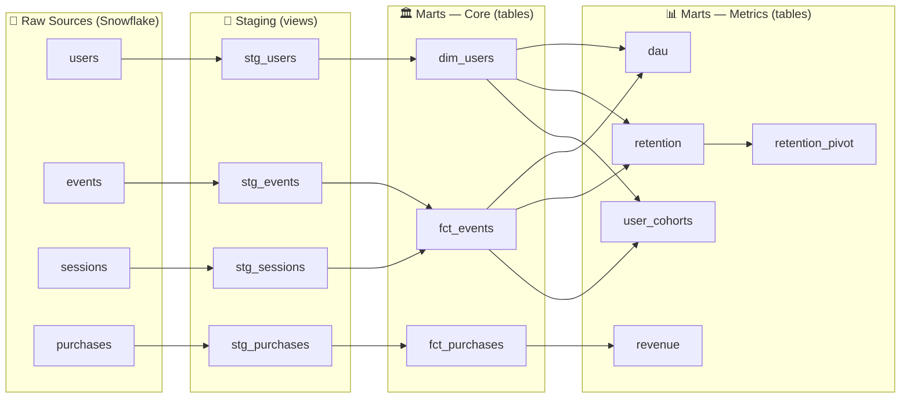

# 🎮 Gaming Analytics Pipeline — dbt + Snowflake

> End-to-end analytics engineering project simulating a mobile gaming company's data stack:
> synthetic data generation → Snowflake ingestion → dbt transformation → business-ready metrics.

---

## 📌 Overview

This project models an analytics pipeline for a gaming company, turning raw event data into structured, documented, and tested data models ready for business consumption.

The focus is on **analytics engineering best practices**: layered architecture, dimensional modeling, reusable metrics, custom macros, and a combination of generic and singular data tests — not just running `dbt run`.

**Key business questions answered:**
- How many users are active each day? *(DAU)*
- How much revenue is the game generating? *(Revenue)*
- Are users coming back after their first session? *(Cohort Retention)*
- How do different acquisition cohorts compare over time? *(User Cohorts)*

---

## 🏗️ Architecture

Data flows through four distinct layers, each with a clear responsibility:



| Layer | Materialization | Purpose |
|---|---|---|
| **Staging** | `view` | Rename columns, cast types, light cleaning. 1:1 with raw tables. |
| **Core (Dims & Facts)** | `table` | Dimensional model — user attributes and immutable business events. |
| **Metrics** | `table` | Business-facing aggregations consumed by dashboards. |

---

## ⚙️ Tech Stack

| Tool | Role |
|---|---|
| **Snowflake** | Cloud data warehouse |
| **dbt Core** | Data transformation, testing, documentation |
| **Python + pandas** | Synthetic data generation |
| **SQL** | Manual scripts for Snowflake setup and data loading |
| **GitHub** | Version control |

---

## 📁 Project Structure

```
├── scripts/
│   └── generate_data.py               # Generates synthetic CSV data
├── sql/
│   ├── create_database.sql            # Snowflake database setup
│   ├── create_schemas.sql             # Schema definitions
│   ├── create_raw_tables.sql          # Raw table DDL
│   ├── load_users.sql                 # COPY INTO statements per entity
│   ├── load_events.sql
│   ├── load_sessions.sql
│   └── load_purchases.sql
├── dbt/
│   ├── macros/
│   │   └── generate_schema_name.sql   # Custom macro for schema naming
│   ├── models/
│   │   ├── staging/                   # stg_users, stg_events, stg_sessions, stg_purchases
│   │   └── marts/
│   │       ├── core/                  # dim_users, fct_events, fct_purchases
│   │       └── metrics/               # dau, revenue, retention, retention_pivot, user_cohorts
│   ├── tests/                         # Singular (custom) data quality tests
│   │   ├── test_events_before_signup.sql
│   │   ├── test_no_future_events.sql
│   │   └── test_no_negative_revenue.sql
│   └── dbt_project.yml
```

---

## 📐 Design Decisions

**Staging as a clean interface layer**
All raw tables are first referenced through staging models that handle type casting and column renaming. Downstream models never read from raw sources directly — any source-side change only needs to be fixed in one place.

**Separate `retention` and `retention_pivot` models**
The cohort retention logic lives entirely in `retention`, which computes day-over-day return rates per cohort. `retention_pivot` is a pure presentation layer that reshapes that output into a day_0–day_7 matrix for dashboards. Splitting them keeps the business logic testable and reusable without duplicating SQL.

**Materialization strategy**
Staging models are `views` — always fresh, zero storage cost. All mart models (core and metrics) are `tables` for query performance, since they're the layer that dashboards and analysts hit directly.

**Custom `generate_schema_name` macro**
A custom macro overrides dbt's default schema naming behaviour to give full control over how schemas are named in Snowflake, avoiding the default `<target_schema>_<model_schema>` naming pattern across environments.

**Singular tests for business-critical rules**
Beyond generic `not_null`, `unique`, and `relationships` tests, three custom singular tests enforce domain-specific rules that generic tests cannot express: no events before a user's signup date, no events with future timestamps, and no negative revenue values.

---

## 📊 Data Models

### Core

| Model | Type | Description |
|---|---|---|
| `dim_users` | Dimension | User attributes: `user_id`, `signup_date`, `country`, `acquisition_channel` |
| `fct_events` | Fact | All user interaction events: `event_id`, `user_id`, `event_type`, `event_timestamp` |
| `fct_purchases` | Fact | All purchase transactions: `purchase_id`, `user_id`, `amount`, `purchase_timestamp` |

### Metrics

| Model | Description |
|---|---|
| `dau` | Daily count of distinct active users |
| `revenue` | Daily total revenue aggregated from purchases |
| `retention` | Cohort retention rates by `days_since_signup` — tracks `active_users`, `cohort_size`, and `retention_rate` per cohort |
| `retention_pivot` | Retention reshaped as a matrix: one row per cohort, columns `day_0` through `day_7` |
| `user_cohorts` | User-level cohort analysis for comparing acquisition channel performance over time |

---

## ✅ Testing Strategy

Tests are applied at two levels:

**Generic tests** (`schema.yml`):

| Test | Applied to |
|---|---|
| `not_null` | All primary keys and critical timestamps across fcts and dims |
| `unique` | Primary keys on `fct_events`, `fct_purchases`, `dim_users` |
| `relationships` | `fct_events.user_id → dim_users.user_id` and `fct_purchases.user_id → dim_users.user_id` |

**Singular tests** (`tests/`) — custom SQL encoding domain-specific rules:

| Test | Rule enforced |
|---|---|
| `test_events_before_signup` | No event can have a timestamp earlier than the user's signup date |
| `test_no_future_events` | No event timestamp can be set in the future |
| `test_no_negative_revenue` | No purchase can have a negative amount |

```bash
dbt test
```

---

## 🚀 How to Run

### Prerequisites
- Python 3.9+ with `pandas` installed
- A Snowflake account (free trial works)
- dbt Core with the Snowflake adapter: `pip install dbt-snowflake`

### 1. Generate synthetic data

```bash
python scripts/generate_data.py
```

This produces CSV files simulating users, events, sessions, and purchases for a mobile game.

### 2. Set up Snowflake

Run the scripts in order inside a Snowflake worksheet:

```sql
-- 1. Database and schemas
sql/create_database.sql
sql/create_schemas.sql

-- 2. Raw table structure
sql/create_raw_tables.sql

-- 3. Load data (stage CSVs first via Snowflake UI or SnowSQL)
sql/load_users.sql
sql/load_events.sql
sql/load_sessions.sql
sql/load_purchases.sql
```

### 3. Configure dbt

Create `~/.dbt/profiles.yml`:

```yaml
gaming_dbt:
  target: dev
  outputs:
    dev:
      type: snowflake
      account: <your_account>
      user: <your_user>
      password: <your_password>
      role: <your_role>
      database: GAMING_ANALYTICS
      warehouse: <your_warehouse>
      schema: STAGING
      threads: 4
```

### 4. Run the pipeline

```bash
cd dbt
dbt deps           # install packages
dbt run            # build all models
dbt test           # run all tests (generic + singular)
dbt docs generate  # generate documentation
dbt docs serve     # open docs at localhost:8080
```

---

## 💡 Key Learnings

- **The staging layer enforces discipline by design.** Having raw sources only accessible through staging models made it immediately clear when business logic was creeping too close to the source — the architectural constraint is the feature.
- **Singular tests catch what generic tests miss.** Writing `test_events_before_signup` surfaced an assumption about data ordering that `not_null` and `unique` would never catch. Custom SQL tests are where real data quality guarantees live.
- **Separating retention logic from its presentation pays off.** When the pivot format needed to change, only `retention_pivot` required edits — the underlying cohort SQL in `retention` stayed untouched.
- **A custom `generate_schema_name` macro matters in practice.** dbt's default schema naming is confusing in multi-schema Snowflake setups. One small macro gives full control over where each layer lands.

---

## 📈 Roadmap

- [ ] Add incremental materialization to `fct_events` for scalability
- [ ] Set up GitHub Actions for CI — run `dbt build` on every pull request
- [ ] Publish dbt docs to GitHub Pages
- [ ] Add `dbt source freshness` checks to simulate pipeline monitoring
- [ ] Build a dashboard (Metabase or Power BI)

---

## 👤 Author

**João Grangeia Gomes**  